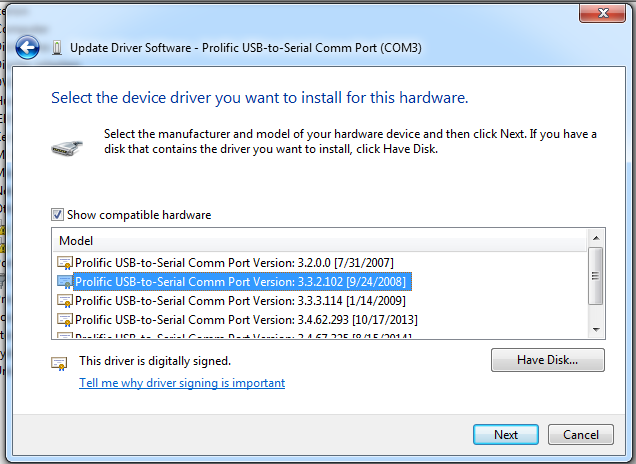

## How to get USB-to-serial to work ##
Windows likes to install the latest available driver for this device, but the Prolific USB-to-Serial cable that comes with the Current Cost EnviR will only work with specific versions of the driver.
### 64-bit Windows ###
1. Install 64-bit driver from drivers directory here, or download driver from one of the following: 
 - http://www.totalcardiagnostics.com/files/PL2303_64bit_Installer.exe
 - http://www.currentcost.com/software-downloads.html (choose link "For Windows Vista and Windows 7, download these drivers") 
2. Unplug device, install driver, plug it in when installer tells you to
3. Make sure Windows is using the right driver
 - Run devmgmt.msc
 - Under Ports (COM & LPT) right-click on Prolific USB-to-Serial Comm Port and choose Update Driver Software
 - Browse my computer for driver software
 - Let me pick from a list of device drivers on my computer
 - From the list, choose the driver dated 24 Sept. 2008 (version 3.3.2.102) 
  
4. Cross your fingers and hope for the best 

### 32-bit Windows ###
1. Install 64-bit driver from drivers directory here, or download driver from one of the following:
 - http://www.totalcardiagnostics.com/files/PL-2303_Driver_Installer.exe 
 - http://www.currentcost.com/software-downloads.html
	Choose link: For Windows Vista and Windows 7, download these drivers
2. Unplug device, install driver, plug it in when installer tells you to
3. Make sure Windows is using the right driver
 - Run devmgmt.msc
 - Under Ports (COM & LPT) right-click on Prolific USB-to-Serial Comm Port and choose Update Driver Software
 - Browse my computer for driver software
 - Let me pick from a list of device drivers on my computer
 - From the list, choose the driver dated 20 Nov. 2007 (version 2.0.2.8) 
4. Cross your fingers and hope for the best
