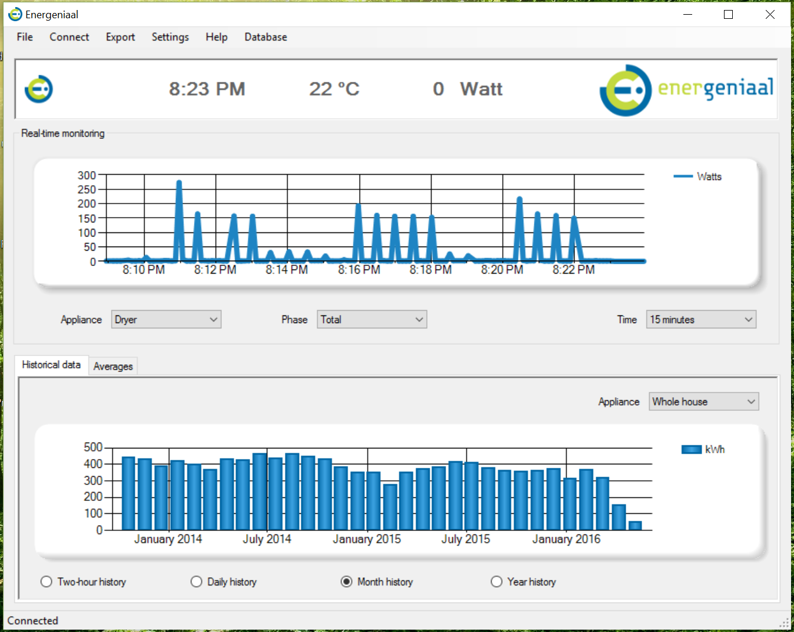

## Energeniaal ##
*Claire Pritchard*  
*November 2014*

Energeniaal is a Windows application that reads data that the [Current Cost](http://currentcost.com/) EnviR Display Unit receives from a smart energy meter.

Real-time data from the EnviR includes current time, temperature, and energy usage. In addition, the EnviR outputs three types of historical data, which are shown in the application's historical data charts and can be exported as CSV files. The kilowatt hours for each appliance are the total usage of all phases.
#### Features ####

 - Real-time display of current time, temperature, and energy usage
 - Data is saved to a SQLite database and can be exported as CSV or imported from CSV
 - Historical data charts, including monthly and yearly usage, and average usage per day of the week
 - User interface in English, Spanish, German, Italian, or Dutch
 - Installer

#### About the data ####
 - The last 31 days' energy usage is output as 2-hour aggregates of kWh, the data being aggregated starting at odd hours, eg 23:00 to 01:00, 01:00 to 03:00 etc. 
 - The last 90 days' energy usage is output as daily aggregates of kWh.
 - The last 84 months' energy usage is output as monthly aggregates of kWh. A month is defined as a 30-day period, starting when the device was last reset. It does not represent a calendar month.
Approximate energy usage for each calendar year is calculated by the Energeniaal application, on the basis of available monthly and daily data.

The Energeniaal application does not store data that is older than what would be stored on the Current Cost Display.
#### Reading from the EnviR####
The EnviR Display Unit connects to the PC with a USB to serial cable, with text output from the serial port in the form of XML. Historical data stored on the device can be downloaded at any time by pressing and holding the OK and Down buttons together until the LED flashes.
#### Credits ####
The application was created for [Energeniaal](https://energeniaal.nl/). Logos were supplied by Energeniaal. Additional logos and translations were supplied by Current Cost Italia (Italian), Cliensol Energy (Spanish), and Energiebewusstsein (German).
> Written with [StackEdit](https://stackedit.io/).
