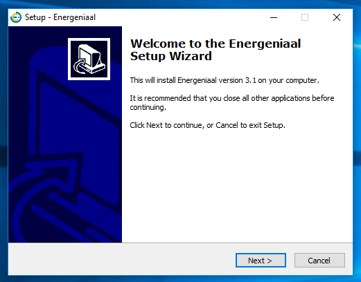

## Inno Setup Scripts ##
This project makes use of Inno Setup scripts to generate a set of executable installers. Multiple installers are created to allow customized versions of the application to be distributed by various Energeniaal partners. 

The generated setup files can be found in the Output directory.

> Written with [StackEdit](https://stackedit.io/).
